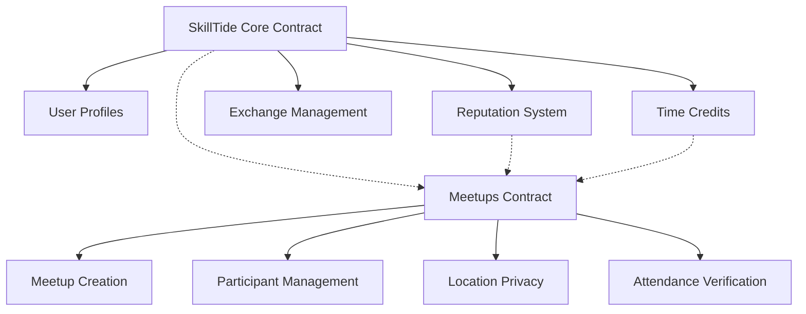

# SkillTide Exchange Platform

A decentralized skill exchange platform enabling trust-based learning through time credits and location-based meetups.

## Overview

SkillTide is a peer-to-peer learning platform that facilitates knowledge exchange without traditional currency. Users can teach their skills to earn time credits, which they can then spend to learn from others. The platform supports both virtual exchanges and in-person meetups.

### Key Features
- Time-credit based economy
- Skill and interest matching
- Location-based meetup organization
- Reputation and trust system
- Secure exchange management
- Dispute resolution mechanism

## Architecture

The platform consists of two main smart contracts that work together to provide the complete functionality:



### Core Contract
Handles user profiles, skills/interests, time credits, and virtual exchanges.

### Meetups Contract
Manages in-person meetups, location privacy, and attendance verification.

## Contract Documentation

### SkillTide Core Contract (`skill-tide-core.clar`)

Primary contract managing user profiles, exchanges, and the time-credit economy.

#### Key Functions:
- `register-user`: Create new user profile
- `create-exchange-request`: Initiate a teaching/learning exchange
- `complete-exchange`: Mark an exchange as completed
- `rate-exchange`: Rate exchange participants
- `dispute-exchange`: Initiate dispute resolution

### Meetups Contract (`skill-tide-meetups.clar`)

Manages location-based skill exchange meetups with privacy and safety features.

#### Key Functions:
- `create-meetup`: Create a new in-person meetup
- `join-meetup`: Register for a meetup
- `confirm-participation`: Confirm attendance
- `verify-attendance`: Verify another participant's attendance

## Getting Started

### Prerequisites
- Clarinet
- Stacks wallet for testnet/mainnet deployment

### Installation
1. Clone the repository
2. Install dependencies:
```bash
clarinet install
```

### Basic Usage

1. Register a new user:
```clarity
(contract-call? .skill-tide-core register-user 
    "username" 
    "bio" 
    (some {
        latitude: 40.7128,
        longitude: -74.0060,
        city: "New York",
        country: "USA"
    })
)
```

2. Add skills:
```clarity
(contract-call? .skill-tide-core add-skill 
    "JavaScript" 
    "Programming" 
    "Modern JavaScript development"
)
```

3. Create an exchange request:
```clarity
(contract-call? .skill-tide-core create-exchange-request
    'ST1PQHQKV0RJXZFY1DGX8MNSNYVE3VGZJSRTPGZGM
    "JavaScript"
    u2
    "Seeking JavaScript tutoring"
)
```

## Function Reference

### Core Contract

#### User Management
- `register-user(username, bio, location)`
- `update-profile(username, bio, location)`
- `add-skill(skill-name, category, description)`
- `add-interest(interest)`

#### Exchange Management
- `create-exchange-request(teacher, skill, credits, notes)`
- `accept-exchange(exchange-id)`
- `complete-exchange(exchange-id)`
- `rate-exchange(exchange-id, rating, is-rating-teacher)`

### Meetups Contract

#### Meetup Management
- `create-meetup(title, description, skill, location-hash, exact-location, max-participants, start-time, end-time, reputation-required)`
- `join-meetup(meetup-id)`
- `confirm-participation(meetup-id)`
- `verify-attendance(meetup-id, attendee)`

## Development

### Testing
Run the test suite:
```bash
clarinet test
```

### Local Development
1. Start Clarinet console:
```bash
clarinet console
```

2. Deploy contracts:
```bash
clarinet deploy
```

## Security Considerations

### Time Credits
- Credits are locked during pending exchanges
- Platform fee is automatically deducted
- Dispute resolution can redistribute credits

### Meetups
- Location data is private until participation is confirmed
- Multiple attendee verifications required
- Host reputation requirements enforced

### Access Control
- Function-level authorization checks
- Rate limiting on reputation actions
- Protected dispute resolution system

### Known Limitations
- No support for recurring meetups
- Basic dispute resolution mechanism
- Location privacy relies on off-chain coordination